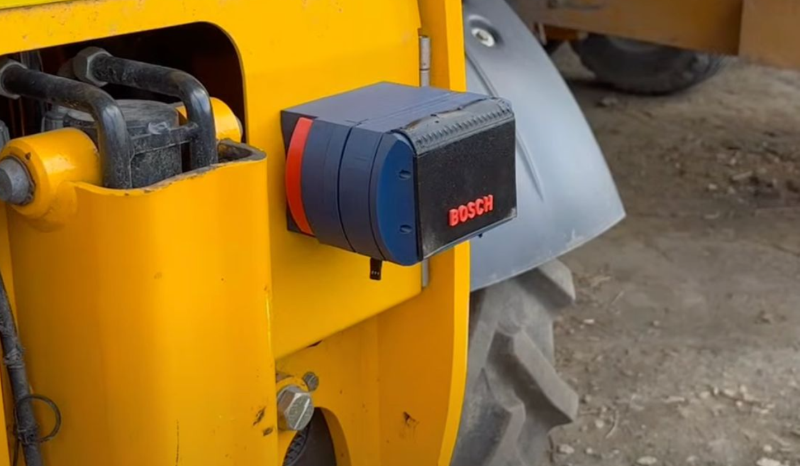
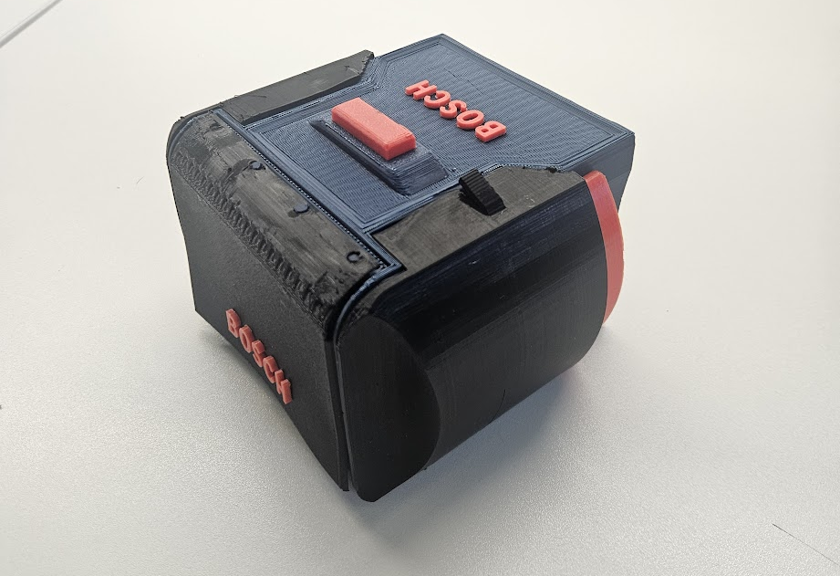
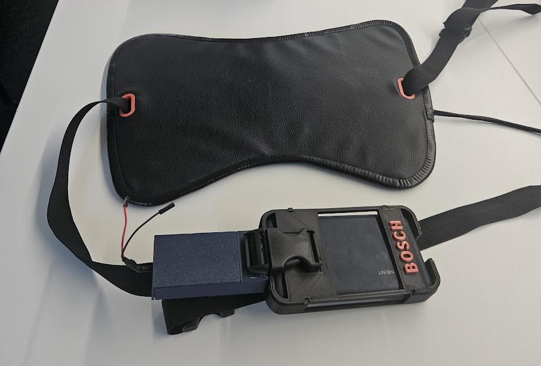
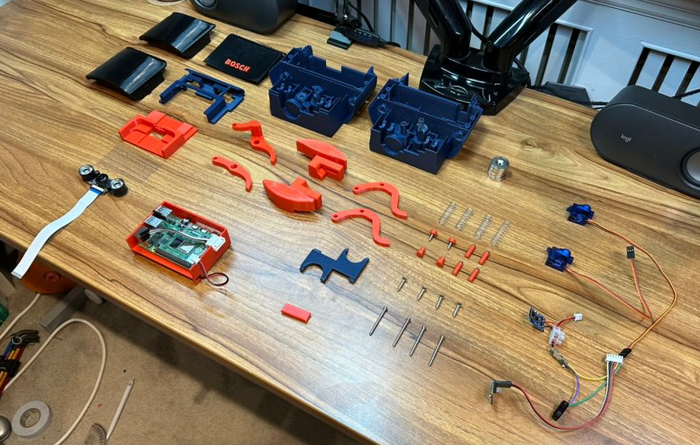

# Reversing Tractor Safety Device (HCM 1-Pro)

A modular reversing-assist prototype for agricultural vehicles that detects pedestrians behind the vehicle and provides directional haptic feedback through a seat-mounted 24-zone vibration array.

Designed for:
- A University project
- Research
- Field testing
- Demonstrations
- Agricultural safety exploration

---

# Hero Image




---

# Overview

Reversing accidents around farms cause serious injuries and fatalities every year.  
The HCM 1-Pro project combines computer vision, embedded systems, and haptic feedback to improve driver awareness while reversing large agricultural vehicles.

The system consists of:

- A rear-mounted intelligent camera module
- A haptic feedback seat overlay
- Wireless communication between modules
- Real-time pedestrian detection
- Directional vibration alerts

When a pedestrian is detected behind the vehicle, the seat vibrates in the corresponding direction to indicate the pedestrian’s location relative to the driver.

---
**This was a University Innovation in Design Project, NOT FOR ACTUAL USE**
---

# Main Device




---

# Haptic Feedback Device




---

# Assembly / Exploded View




---

# Features

## Intelligent Pedestrian Detection

- IR / night-vision camera support
- Real-time human detection
- Bounding-box position tracking
- Confidence scoring
- Low-light operation

---

## Directional Haptic Feedback

The driver receives intuitive physical feedback instead of relying solely on visual or audio warnings.

Features include:

- 24 vibration motors
- Directional alerts
- Proximity/intensity indication
- Seat-mounted ergonomic design
- Wireless communication

---

## Rugged Agricultural Design

Designed for harsh outdoor environments:

- Mud-resistant enclosure
- Magnetic mounting system
- TPU flexible door
- Nylon structural casing
- Outdoor-ready electronics
- Rechargeable battery system

---


# Startup Behaviour (Autoconnect)

When the rear module boots it runs:

```text
src/main.py
```

Startup sequence:

1. Attempt to join the configured Wi-Fi network
2. If Wi-Fi is unavailable, connect directly to the seat controller
3. Optionally create an Access Point (AP) for local testing
4. Open a UDP socket and begin sending haptic commands

Default seat controller address:

```text
192.168.4.2:5000
```

Configuration variables are defined in:

```text
src/config.py
```

or via environment variables read by `main.py`.

---

# Signal Format & Transport

Low-latency UDP is used for haptic commands.

## JSON Format

```json
{
  "timestamp": "2026-05-13T20:00:00Z",
  "zone": 5,
  "intensity": 200,
  "duration_ms": 350,
  "bbox": [120,240,300,560],
  "confidence": 0.86
}
```

---

## Compact CSV Format

```text
5,200,350
```

Format:

```text
zone,intensity,duration_ms
```

---

# Hardware Overview

## Rear Module

- Raspberry Pi 4
- IR Camera
- IMU
- Servo-actuated mudguard
- USB-C charging
- LiPo battery system

---

## Haptic Seat

- Raspberry Pi Zero W
- 24 ERM vibration motors
- EVA foam support structure
- Faux leather cover
- Adjustable mounting straps

---

# Networking

Supported modes:

| Mode | Description |
|---|---|
| Wi-Fi Client | Connects to existing network |
| Direct Connection | Connects directly to seat controller |
| AP Mode | Creates local hotspot for testing |

---

# Example Workflow

```text
Pedestrian detected
        ↓
Bounding box generated
        ↓
Direction calculated
        ↓
UDP packet transmitted
        ↓
Seat controller activates vibration zone
```

---

# Future Improvements

Potential future work:

- Machine learning pedestrian tracking
- CAN bus integration
- Waterproof production PCB
- Battery optimisation
- Vehicle telemetry support
- Fleet-wide networking
- Ultrasonic / radar fusion

---

# Safety Notice

This project is a prototype and researched for a University Project. **NOT FOR ACTUAL USE**

---

# Maintainer

Maintained by:

**HarryWarriner**

GitHub:  
https://github.com/HarryWarriner
